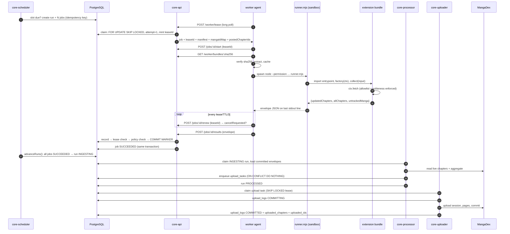

# Architecture guide

How publoader actually works, traced through the code. If you read one document
before touching this repo, read this one.

This is the *explanatory* companion to
this document, which is the binding design
reference and records why each choice was made. Where the two disagree, the code
wins and this document is the one that cites it.

**Contents**

- [The problem, and the shape of the answer](#the-problem-and-the-shape-of-the-answer)
- [Three planes](#three-planes)
- [The processes](#the-processes)
- [Lifecycle of one scheduled run](#lifecycle-of-one-scheduled-run)
- [The job state machine](#the-job-state-machine)
- [Why exactly-once holds](#why-exactly-once-holds)
- [Partitioned execution](#partitioned-execution)
- [The credential model](#the-credential-model)
- [The untracked-title pipeline](#the-untracked-title-pipeline)
- [The database is the configuration authority](#the-database-is-the-configuration-authority)
- [Observability](#observability)

---

## The problem, and the shape of the answer

Publisher sites (Manga Plus, and others) publish chapters. MangaDex wants those
chapters mirrored. Somebody has to notice a new chapter, decide whether it is
genuinely new, and upload it exactly once.

Three properties make this harder than a cron job.

1. **Scraping is untrusted work.** Every publisher needs its own scraper, those
   scrapers are the part that changes most often, and they are the part most
   likely to be contributed by someone other than the operator. Running them on
   the machine that holds the MangaDex credentials means a scraper bug is a
   MangaDex incident.
2. **Scraping wants to be distributed; uploading must not be.** Publisher sites
   rate-limit per source IP, so throughput comes from spreading scrapers across
   hosts. MangaDex upload sessions are per-account state, so exactly one process
   may hold one.
3. **Duplicate uploads are the expensive failure.** A worker can crash after
   scraping and before reporting, or report twice, or report late after being
   declared dead. Any of those becoming a second upload is a visible mess on a
   public catalogue.

The answer is a split: **untrusted, distributed, credential-free workers do the
scraping; one trusted control plane makes every decision and holds every
credential.** Workers never write to the database and never talk to MangaDex.
They produce one document, a [result envelope](#5-ingest-validates-the-envelope),
 and the control plane decides what it means.

---

## Three planes

```
┌─────────────────────────────────────────────────────────────────────────┐
│ CONTROL PLANE            operator's own host, holds every credential    │
│                                                                         │
│   ┌──────────┐  ┌───────────────┐  ┌───────────────┐  ┌─────────────┐  │
│   │ core-api │  │core-scheduler │  │core-processor │  │core-uploader│  │
│   │ HTTP     │  │ the clock     │  │ decide work   │  │ ONLY MD     │  │
│   │ dashboard│  │ + lease sweep │  │ (MD read)     │  │ writer      │  │
│   └────┬─────┘  └───────┬───────┘  └───────┬───────┘  └──────┬──────┘  │
│        │                │                  │                 │         │
│        └────────────────┴──────┬───────────┴─────────────────┘         │
│                               │                                        │
│                    ┌──────────▼───────────┐                            │
│                    │      PostgreSQL      │  single source of truth    │
│                    │ runs jobs leases     │  no in-memory queues       │
│                    │ envelopes bundles    │  no JSON config files      │
│                    │ chapters config audit│                            │
│                    └──────────────────────┘                            │
└───────────────────────────────┬─────────────────────────────────────────┘
                                │  HTTPS, worker token only
                ┌───────────────┴───────────────┐
                │                               │
┌───────────────▼──────────────┐ ┌──────────────▼───────────────┐
│ DATA PLANE   worker host A   │ │ DATA PLANE   worker host B   │
│  agent: lease → execute →    │ │  (may be a machine the       │
│         submit envelope      │ │   operator does not control) │
│                              │ │                              │
│  ┌────────────────────────┐  │ │  no DB URL                   │
│  │ EXTENSION RUNTIME      │  │ │  no MangaDex credential      │
│  │ node --permission      │  │ │  no Discord webhook          │
│  │ runner.mjs + bundle    │  │ │  outbound-only, no listener  │
│  │ guarded fetch only     │  │ │                              │
│  └────────────────────────┘  │ │                              │
└──────────────────────────────┘ └──────────────────────────────┘
```

**Control plane**: `core-api`, `core-scheduler`, `core-processor`,
`core-uploader`, and Postgres. Runs on the operator's host. Holds the MangaDex
account, the database, the Discord webhooks, and the admin token. It is the only
thing that decides anything.

**Data plane**: worker agents. Lease a job, fetch and verify the pinned bundle,
run the extension, submit an envelope. A worker's entire blast radius is its own
token and whatever bundle it was handed
(`docker/worker/Dockerfile:3-13`).

**Extension runtime**: the sandbox inside a worker: a separate Node process
launched with the permission model on, executing `runner-node/runner.mjs`, which
imports the bundle's entrypoint and calls one method. This is the boundary
between "code the operator reviewed" and "code that scrapes a website".

The seam that makes this safe is narrow on purpose. A worker's only inputs are the
lease payload and the bundle; its only output is one envelope. It cannot write a
row, cannot reach MangaDex, and cannot make the control plane believe anything the
control plane did not verify for itself.

---

## The processes

Six entry points, one image for the four core services (`docker/core/Dockerfile`)
and one for the worker (`docker/worker/Dockerfile`).

| Service | Entry point | Loop | Interval | Needs MD creds? | Replicas |
| --- | --- | --- | --- | --- | --- |
| `core-api` | `src/services/api.ts` | none; Fastify listener |; | optional, and **reads only**: operator title approvals run synchronously, and the chapter views show the live MangaDex state and preview the unavailable card. Chapter changes are queued for the uploader | 1+ |
| `core-scheduler` | `src/services/scheduler.ts` | `scheduler.tick()` | `SCHEDULER_INTERVAL_SECONDS`, 30 s | no | **exactly 1** by convention; racing is harmless |
| `core-processor` | `src/services/processor.ts` | `processor.tick()` | 15 s (`INTERVAL_SECONDS`, a module constant) | yes; reads MangaDex | 1; several are safe |
| `core-uploader` | `src/services/uploader.ts` | drain queues + `titles.tick()` | event-driven, 5 s idle sleep | **yes; write credentials** | **exactly 1** (MangaDex sessions are per-account) |
| `publoader-bot` | `src/services/bot.ts` | Discord gateway |; | no | 1 |
| worker agent | `src/services/worker.ts` | long-poll lease | 25 s poll | no | many |

Two of those constraints are load-bearing rather than advisory.
`core-uploader` must be single because MangaDex allows one open upload session per
account and two uploaders would clobber each other's. `core-scheduler` *may* be
replicated safely, every action it takes is idempotent or a compare-and-set, but
there is no throughput reason to, because workers are the throughput.

---

## Lifecycle of one scheduled run

Traced end to end. The example is a Manga Plus `UPDATE` run at 15:05 UTC.



### 1. The scheduler creates a run and its jobs

`scheduler.tick()` (`src/core/scheduler/service.ts:39-72`) runs every 30 s. It
reads the persisted `scheduler_last_tick` setting, so a scheduler that was down
resumes exactly where it left off rather than storming through history; and on
first boot it looks back one minute only (`service.ts:75-77`).

An extension has a **list** of schedule slots, not one time: a 15:00 update, a
01:00 update and a Wednesday 01:00 clean are three independent decisions about
when to run and what kind of run to create. Effective schedules are the
manifest's `schedule` list *replaced* by `schedule_entries` rows when the
extension has any, minus anything in `disabled_extensions`
(`scheduler/slots.ts`). Replacement rather than merge, because a merge has no
way to say "not that one": an operator could never drop a slot the manifest
declared. Presence of rows decides it, not their count: an extension whose every
row is switched off runs *nothing*, since falling back there would turn "pause
the weekly clean" into "and now do whatever the manifest said".

A slot is due when its UTC minute falls in `(lastTick, now]`, compared at
whole-minute resolution, and its weekday set (empty = every day) contains the
candidate's weekday. Comparing minutes is what makes ticks idempotent and
crash-tolerant: a scheduler down over the slot still creates the run on its next
tick within the same UTC day. Judging the weekday against the *candidate* rather
than `now` is what makes that recovery correct across a midnight boundary.

Then `createRunForExtension` (`service.ts`) computes
[segments](#partitioned-execution) and calls `createRun`, whose idempotency key is
`sched:<extension>:<slot>:<kind>`. The kind is in the key so an update and a
clean scheduled at the same minute produce one run each, while two slots that
agree on both minute and kind collapse to a single run, which is what makes a
duplicated slot harmless. `createRun` (`store/jobs.ts:72-129`) inserts the run
and all its jobs **in one transaction**, and a duplicate key returns the existing
run untouched. It handles the concurrent case explicitly: a `P2002` unique
violation means another creator won, so it returns theirs
(`jobs.ts:119-128`).

Each job is stamped with the bundle's sha256. That is the version pin, and it
never changes for the life of the job.

### 2. A worker leases the job

The agent long-polls `POST /api/v1/worker/lease` (`worker/coreApi.ts:277-297`).
The endpoint holds the request open, retrying the claim once a second until
`waitSeconds` elapses (`routes/worker.ts:88-177`).

The claim is one statement (`store/jobs.ts:153-186`):

```sql
WITH candidate AS (
  SELECT id FROM jobs
  WHERE state = 'PENDING' AND not_before <= now() AND cancel_requested = false
    AND extension = ANY($extensions)     -- when the worker narrowed
    AND min_trust = 'COMMUNITY'          -- when the worker is COMMUNITY
  ORDER BY not_before ASC
  FOR UPDATE SKIP LOCKED
  LIMIT 1
)
UPDATE jobs j
SET state = 'LEASED', lease_id = $leaseId, lease_worker_id = $workerId,
    lease_expires_at = now() + make_interval(secs => $ttl),
    attempt = j.attempt + 1, updated_at = now()
FROM candidate WHERE j.id = candidate.id
RETURNING …
```

Four things are worth noticing.

- `FOR UPDATE SKIP LOCKED` is why two concurrent claimers can never select the
  same row. Not a mutex, not application logic; the row lock.
- `attempt` increments on **claim**, not on failure. A worker that dies without
  reporting has still spent an attempt.
- The trust filter is *in the query*. A `COMMUNITY` worker cannot lease a
  `TRUSTED`-only job even if the API layer were wrong.
- `lease_id` is a fresh UUID. It, not the worker id, is what every later
  transition names.

The response bundles everything the job needs, and the configuration half comes
from the **database**, not from the bundle (`routes/worker.ts:118-144`):
`mangaIdMap` built from `tracked_manga`, `overrideOptions` from
`extension_configs`, and `postedChapterIds` from `uploaded_ids` (empty for a
`CLEAN` run). The map is delivered in the legacy `{mdMangaId: [externalIds]}`
shape so the runner's compatibility layer needs no translation.

### 3. The worker fetches and verifies the bundle

`BundleCache.ensure()` (`worker/bundleCache.ts:51-87`). Bundles are immutable,
the directory name *is* the sha256, so a cache hit needs no revalidation and
concurrent agents on one host share the tree safely.

On a miss it downloads and **re-hashes the body**, throwing
`BundleIntegrityError` on a mismatch (`worker/coreApi.ts:367-378`). Extraction is
entry-by-entry with an explicit containment check, because adm-zip's bulk
extractor has historically followed `../` entries out of the target directory and
a worker must not depend on the publish pipeline being uncompromised
(`bundleCache.ts:90-113`). The tree is published by an atomic `rename`, with a
completion marker written last; losing the race to another agent is not an error,
because the content is identical by construction.

### 4. The runner executes the extension under the permission model

`JobExecutor.execute()` (`worker/executor.ts:134-257`) writes `job.json` into a
fresh temp directory and spawns a **separate Node process**. The argv *is* the
sandbox (`executor.ts:314-336`):

```
node --disallow-code-generation-from-strings
     --permission
     --allow-fs-read=<bundleDir>     the extension's code and data files
     --allow-fs-read=<runnerDir>     so Node can load runner.mjs itself
     --allow-fs-read=<workdir>       job.json
     --allow-fs-write=<outputDir>    page images
     --allow-fs-write=<workdir>      scratch
     runner-node/runner.mjs --bundle … --job … --output …
```

What each flag buys, and what it does not:

- `--disallow-code-generation-from-strings` makes `eval` and `new Function` throw.
  A bundle is a single pre-built ESM file reviewed at publish; fetching code and
  evaluating it at run time is never legitimate here.
- `--permission` turns on the model. Beyond the filesystem grants it **denies
  `child_process` and `worker_threads` outright**, which is most of the reason to
  use it: an extension cannot shell out or spawn a thread to escape the guarded
  fetch.
- Network is deliberately *not* restricted by the permission model; it has no
  network component. Egress control is the guarded fetch's job.
- Every path gets its own flag. Node 24 no longer accepts a comma-separated list;
  it warns and honours only the first (`executor.ts:290-293`).

The environment is minimal on purpose, `PATH`, `HOME`, `TMPDIR`, `LANG` and
nothing else, so the extension cannot read the worker token or the core URL
(`executor.ts:363-368`, `394-396`). The child is `detached`, so a timeout kills
the whole process group and not just the direct child (`executor.ts:399`,
`428-445`).

Inside the sandbox, `runner.mjs` (`runner-node/runner.mjs`):

- **captures stdout before any bundle code runs** and redirects it to stderr,
  including the `console` methods, because stdout is the envelope channel
  (`runner.mjs:61-78`);
- builds the context: a frozen manifest, the inverted `mangaIdMap`
  (external → MangaDex), `dataFile()` that cannot escape the bundle directory,
  `log()` to stderr, and the guarded `fetch` (`runner.mjs:309-323`);
- imports the entrypoint and refuses it if `default` is not a function
  (`runner.mjs:532-556`);
- calls `collect({postedChapterIds, cleanRun, trackedSubset})`;
- normalizes the result, dropping chapters with no usable MangaDex mapping the
  way v1's `md_manga_id is None` filter did (`runner.mjs:604-629`);
- **filters output to the segment unconditionally**, whether or not the extension
  honoured `trackedSubset` (`runner.mjs:637-642`);
- prints the envelope as the last line of stdout and exits 0. A failed run is a
  *result*, not a crash (`runner.mjs:746-767`).

Error classification happens here and matters downstream. A bundle that will not
import, a factory that will not construct, or a result of the wrong shape are all
properties of the pinned bundle, so they are `PERMANENT`: a retry cannot help. A
throw from inside `collect()` is usually the upstream site, so it is `TRANSIENT`
(`runner.mjs:566-599`, `754`).

The guarded fetch (`src/extsdk/guardedFetch.ts`, duplicated inline in
`runner.mjs:112-272`) is the only network primitive the extension gets. It:

- checks `allowed_hosts` before the first packet **and again on every redirect
  hop**: a 302 to an unlisted host is the obvious way to turn an allowlisted
  request into an arbitrary one (`guardedFetch.ts:195-214`);
- imposes a per-host minimum interval, so politeness is enforced rather than
  hoped for;
- gives every attempt a wall-clock timeout;
- retries 5xx and transport errors a bounded number of times, and **obeys**
  `Retry-After` on a 429 rather than retrying blindly, with a ceiling.

> The runner cannot import from the platform tree; it executes under a read
> allowlist that does not cover `dist/`. So the guarded fetch exists twice and the
> two copies must stay behaviourally identical by hand. Change one, change the
> other (`guardedFetch.ts:21-25`, `runner.mjs:8-14`).

Meanwhile the agent renews the lease every TTL/3 (`worker/agent.ts:242-277`). A
`409` means the lease is gone: abort with reason `lease-lost` and **do not
submit**, because someone else owns the job now. A `cancelRequested: true` aborts
with reason `cancelled`, which *is* submitted, as a `TRANSIENT` error.

### 5. Ingest validates the envelope

`POST /api/v1/worker/jobs/:jobId/results` → `IngestService.ingest()`
(`src/core/ingest/ingest.ts:35-118`). Five gates, in this order, and the order is
the design:

**Gate 0; schema.** `ResultEnvelope.safeParse`. The schema is `.strict()`, so an
unknown field is a rejection rather than a silently dropped key. A failure here
is a 422 and never reaches the database, because there is no job it can be
reliably attributed to (`ingest.ts:35-41`).

**Gate 1; record before judging.** The submission is inserted idempotently under
`res:<jobId>:<attempt>`. If it is a duplicate that was already judged, the prior
verdict is returned unchanged (`ingest.ts:49-53`). This is what turns
at-least-once *delivery* into exactly-once *effect*: a worker whose network
dropped after the server committed can retry safely and gets `committed` back.

**Gate 2; lease validity.** The envelope's `leaseId` must match the job's, the
`workerId` must match the lease holder, and the job must still be `LEASED` or
`RUNNING` (`ingest.ts:55-66`). Anything else is `SUPERSEDED`. This is the gate
that makes a late submission from a worker declared dead into a recorded no-op
rather than data.

**Gate 3; worker-reported failure.** `status: "error"` routes through the retry
policy: `TRANSIENT` requeues with backoff, `PERMANENT` dead-letters
(`ingest.ts:68-81`).

**Gate 4, policy.** The manifest and the database are enforced *as policy on the
data*, using **the core's copy of the manifest for the job's pinned bundle**, a
worker cannot vouch for itself (`ingest.ts:83-94`, `validatePolicy` at
`ingest.ts:135-231`).

The rule the function exists to uphold: **every field the downstream pipeline
trusts must be checked here**, because this is the only gate between an untrusted
worker and canonical state. That is easy to get subtly wrong, and it *was* wrong;
an earlier version validated three fields while the processor went on to consume a
dozen, and the gap was exploitable. A worker holding one legitimate lease could
name any MangaDex title in `mdMangaId`, send `allChapters: []`, and have the
processor conclude that every chapter the group owns on that title had vanished
upstream; and queue it for deletion (`ingest.ts:117-134`).

So the checks are deliberately exhaustive over the envelope:

| Checked | Against | Why it matters |
| --- | --- | --- |
| `bundleSha256` | the job's pin | a worker must not run a different bundle than the one it was given |
| `extension` | the manifest's `name` |; |
| `mangadexGroupId` | the manifest's `mangadex_group_id` | uploads are attributed to a scanlation group |
| `extensionLanguages`, every `chapterLanguage` | the manifest's `languages` **only** | `custom_language` arrives *in the envelope*, so unioning it in here would have let the envelope widen the very allowlist meant to constrain it |
| every `chapterUrl`, `mangaUrl`, and untracked `mangaUrl` | the manifest's `allowed_hosts` | untracked URLs become MangaDex titles and Discord links, so they are attacker-controlled text if unchecked |
| every chapter's `mdMangaId` | `tracked_manga` for this extension | the grouping key for every downstream decision, including removal |
| every `trackedMangadexIds` entry | `tracked_manga` | the processor consumes it as the candidate set for "tracked but gone upstream", i.e. as a removal list |
| every chapter's `extensionName` | the job's extension | a chapter claiming another extension's name would file its bookkeeping, and its uploads, under that extension |
| every untracked `mangaLanguage` | the manifest's `languages` |; |

Anything the processor reads that is *not* checked here is instead re-derived from
the database rather than trusted (see step 7).

A violation is recorded `QUARANTINED` with the exact reason, audited, and the job
is failed with class `POLICY`. Nothing from a quarantined envelope reaches
MangaDex.

Note that `POLICY` **retries** rather than dead-lettering on first sight
(`store/jobs.ts:246-268`). The original reasoning, a rejected envelope will be
rejected again, was wrong in an important way: the envelope is produced by a
*worker*, and a hostile or broken one can fail policy on demand. That handed any
single worker the ability to dead-letter every job it could lease, and
`advanceRuns` then killed those runs along with their healthy segments. Retrying
costs one attempt and, because the next attempt is very likely leased elsewhere,
routes around the bad worker. A genuinely bad *bundle* still dead-letters; it
just takes `maxAttempts` to get there.

**Gate 5; the commit.** `ResultStore.commit()` (`store/results.ts:70-97`) does
two things in one transaction: flip the submission to `COMMITTED`, and mark the
job `SUCCEEDED` gated on the lease id. Either both happen or neither. It returns
false, not an exception, when another submission already committed or the lease
is no longer current, and the caller records `SUPERSEDED`.

Only after a successful commit are referenced artifacts pinned, clearing their
48-hour TTL so the garbage collector cannot take them
(`ingest.ts:104-109`).

### 6. The run advances

The scheduler's next tick calls `advanceRuns()` (`store/jobs.ts:405-431`), two
set-based statements: a run whose jobs are *all* `SUCCEEDED` becomes `INGESTING`;
a run with at least one `DEAD_LETTER`/`CANCELLED` job and nothing still running
becomes `DEAD_LETTER`. Being set-based rather than per-job means this is correct
however many segments a run has and however they interleave.

### 7. The processor decides upload / edit / skip / remove

`RunProcessor.tick()` (`src/core/processor/processor.ts:89-107`) claims the
least-recently-touched `INGESTING` run with `SKIP LOCKED` and a bumped
`updated_at`: a *soft* claim rather than a lease, which is safe precisely because
processing is idempotent (`core/processor/processor.ts:116-132`).

`processRun` (`core/processor/processor.ts:135-286`) then:

1. Loads the committed envelope for every job in the run and merges them
   (`mergeEnvelopes`, `core/processor/processor.ts:629-672`). Segments cover disjoint manga, so
   chapter lists concatenate; **except `allChapters`**, which means "this is
   everything the publisher has". A single segment that declined to answer makes
   the merged view incomplete, so **any null collapses the whole thing to null**.
   Getting this wrong would turn the removal passes into mass deletions.
2. **Refuses to process a `CLEAN` run with missing segments** and stays in
   `INGESTING` (`core/processor/processor.ts:144-146`). A clean run decides deletions from a "the
   publisher no longer has this" premise; acting on a partial view would remove
   chapters a missing segment would have vouched for.

   A **scoped** run (`runs.scope_manga_ids` non-empty, created by the one-series
   re-check) is the deliberate version of a partial view, and is handled by
   narrowing the premise rather than by refusing: its snapshot is authoritative
   for the titles it names and silent about every other one. The processor
   therefore visits the scope even where it reported no updates — the point of a
   re-check is a series that has published nothing for months — and skips both
   catalogue-wide passes below, which read a tracked title's absence from the
   snapshot as "the publisher dropped it". Running them against a scoped
   snapshot would unpublish the entire rest of the catalogue; that is the case
   `test/integration/scopedRun.test.ts` pins, control included.
3. **Replaces the worker-reported configuration with the database's.** Override
   options come from `extension_configs`, and the tracked set is the *union* of
   what the database knows with what the worker reported
   (`core/processor/processor.ts:159-162`, `330-367`). This is not tidiness: override options
   decide what counts as a duplicate and which languages may stay on MangaDex, so
   taking them from worker output would let a compromised worker steer deletions.
4. Persists untracked manga for the [title pipeline](#the-untracked-title-pipeline).
5. For each MangaDex series, reads the **live** MangaDex chapter list and
   aggregate, backfills missing volumes from the aggregate, and calls
   `decideForManga` (`processor/dedupe.ts:477-525`): pure, I/O-free, and
   therefore exhaustively unit-testable (`test/unit/dedupe.test.ts`).

   `decideForManga` sorts every reported chapter into four buckets:

   | Bucket | Meaning |
   | --- | --- |
   | `toUpload` | not on MangaDex → enqueue an `UPLOAD` task |
   | `toEdit` | on MangaDex but a field differs → enqueue an `EDIT` with both old and new state |
   | `skipped` | on MangaDex and identical → bookkeeping only |
   | `skippedDifferentId` | the `same` override says it was already uploaded under its master id → drop, and surface the count |
   | `toRemove` | on MangaDex under our group but in a disallowed language, or no longer among the publisher's chapters → removal queue. Chapters already carrying an unavailable card are excluded: the card flow repoints `externalUrl`, so a carded chapter can never look "still listed" and would otherwise be re-queued on every run |

   Removal is decided from the *untouched* MangaDex listing, before any dedupe,
   and only when the extension supplied a full listing; `allMangaChapters: null`
   disables the pass entirely, while an empty array does not (that legitimately
   means "the publisher has nothing here any more")
   (`dedupe.ts:46-63`, `334-349`, `484`).
6. Enqueues tasks with `ON CONFLICT DO NOTHING` on `(kind, dedupeKey)` and
   records bookkeeping with upserts, then runs the untracked-manga and
   duplicate-sweep passes, then flips the run to `PROCESSED` **last**
   (`core/processor/processor.ts:495-505`). A crash mid-run therefore replays cleanly: every
   effect is idempotent and the second pass is a no-op for whatever already
   landed.

The untracked-manga cleanup pass is skipped when any segment is missing, because
"untracked" is derived from the union of every segment's tracked ids and an absent
segment could make a perfectly tracked series look orphaned
(`core/processor/processor.ts:258-269`).

### 8. The uploader commits to MangaDex

`core-uploader` (`src/services/uploader.ts`) is the only process with MangaDex
write credentials. It sweeps stale leases, then drains the queues in a fixed
order, `DELETE, EDIT, UPLOAD, UNAVAILABLE`, so a chapter removed upstream never
races the re-upload of its replacement (`uploader.ts:28`).

The `UPLOAD` path (`core/md/taskWorkers.ts:88-168`) is the one that must survive a
crash mid-flight, so it is bracketed by `upload_logs` rows: `COMMITTING` before
the session opens, `COMMITTED` with the resulting chapter id after. On retry, a
prior `COMMITTED` row makes the uploader **verify the chapter still exists on
MangaDex** before skipping; a recorded id MangaDex never indexed must re-upload,
not silently vanish (`taskWorkers.ts:95-113`).

Then: close any stale session (MangaDex allows one per account), open a session,
upload pages in batches of 10 with per-batch retries that narrow to the files
MangaDex did not acknowledge, commit, record `uploaded_chapters` and
`uploaded_ids`, delete the artifacts, and queue a Discord embed.

If pages fail, the chapter is still committed as an external-only entry rather
than lost entirely (`taskWorkers.ts:132-135`): the same choice the Python
uploader made.

`UNAVAILABLE` is the interesting one: fetch the live chapter, render an info card
(`core/md/card.ts` → a deterministic 2000×2000 PNG via sharp), open an *edit*
session on that chapter, attach the card as its only page, commit, then `PUT` the
chapter to repoint `externalUrl` away from the dead link; preferring the
publisher's series page, else the site root, else nothing
(`taskWorkers.ts:364-471`, `692-705`).

`DELETE` archives to `deleted_chapters` **before** dropping the live row, because
deletion is the one irreversible action the platform takes
(`taskWorkers.ts:338-350`).

---

## The job state machine

Defined by the store's transitions, not by an enum with hopes attached
(`src/core/store/jobs.ts:11-17`).

```
                    ┌──────────────────────────────────────────┐
                    │                                          │
                    ▼                                          │
  (created) ──> PENDING ──claim──> LEASED ──start──> RUNNING   │
                  │  │               │                 │       │
     cancel       │  │               └────────┬────────┘       │
   (immediate)    │  │                        │                │
                  ▼  │           complete / commit             │
             CANCELLED│                       ▼                │
                      │                  SUCCEEDED  (terminal) │
                      │                                        │
                      │ fail(TRANSIENT|POLICY) && attempt < max│
                      │ or lease expiry        && attempt < max│
                      └────────────────────────────────────────┘
                                             │
                        fail(PERMANENT), or attempt >= max
                                             ▼
                                       DEAD_LETTER
                                             │
                              operator retry │ (attempt := 0)
                                             ▼
                                          PENDING
```

Every transition and its guard:

| From | To | Trigger | Guard (the actual `WHERE`) | Code |
| --- | --- | --- | --- | --- |
| `PENDING` | `LEASED` | worker lease | `state='PENDING' AND not_before<=now() AND cancel_requested=false` + extension/trust filters, `FOR UPDATE SKIP LOCKED LIMIT 1` | `jobs.ts:153-186` |
| `LEASED` | `RUNNING` | `POST /jobs/:id/start` | `id AND leaseId AND state='LEASED'` | `jobs.ts:201-207` |
| `LEASED`/`RUNNING` | *(same)* | `POST /jobs/:id/renew` | `id AND leaseId AND state IN(…) AND lease_expires_at > now()` | `jobs.ts:214-232` |
| `LEASED`/`RUNNING` | `SUCCEEDED` | envelope committed | `id AND leaseId AND state IN(…)`, **inside the commit transaction** | `results.ts:78-87` |
| `LEASED`/`RUNNING` | `SUCCEEDED` | `complete()` | same guard, without a submission | `jobs.ts:235-241` |
| `LEASED`/`RUNNING` | `PENDING` | `TRANSIENT` or `POLICY` fail, budget left | `id AND leaseId AND state IN(…)`; sets `not_before` to now + jittered backoff, clears the lease | `jobs.ts:283-296` |
| `LEASED`/`RUNNING` | `DEAD_LETTER` | `PERMANENT`, or budget spent | `id AND leaseId AND state IN(…)`; clears the lease | `jobs.ts:268-281` |
| `LEASED`/`RUNNING` | `PENDING` | sweeper, lease expired | `state IN(…) AND lease_expires_at < now() AND attempt < max_attempts`, `SKIP LOCKED` | `jobs.ts:299-330` |
| `LEASED`/`RUNNING` | `DEAD_LETTER` | sweeper, lease expired, budget spent | same but `attempt >= max_attempts` | `jobs.ts:299-330` |
| `PENDING` | `CANCELLED` | operator cancel | `state='PENDING'` | `jobs.ts:355-366` |
| `LEASED`/`RUNNING` | *(flag only)* | operator cancel | sets `cancel_requested`; the worker aborts on its next renew | `jobs.ts:355-371` |
| `DEAD_LETTER` | `PENDING` | operator retry | `state='DEAD_LETTER'`; resets `attempt` to 0, clears the flag, **and revives the parent run** | `jobs.ts:374-398` |

Two of those rows are recent corrections worth knowing about.

**`POLICY` requeues, it does not dead-letter immediately** (`jobs.ts:246-268`).
See [gate 4](#5-ingest-validates-the-envelope): treating a policy rejection as
permanent handed any one worker the ability to dead-letter every job it could
lease.

**Replaying a dead letter revives the run too** (`jobs.ts:374-398`, one
transaction). Previously it reset the job and left the run terminal, so the run
never advanced again; the retry reported success and silently did nothing.

Two properties hold across the whole table.

**Every transition is one statement whose `WHERE` names the expected prior
state**, and for worker-driven transitions the lease id. Zero rows affected means
the caller lost the race and must treat the transition as rejected. There is no
read-then-write anywhere in the file (`jobs.ts:4-9`).

**Backoff has full jitter.** `capped/2 + random·capped/2` (`jobs.ts:54-59`), which
keeps a fleet of simultaneously-requeued jobs from synchronizing into a
thundering herd on the next tick.

---

## Why exactly-once holds

"Exactly once" means: **for each job, at most one result takes effect, and each
decided chapter reaches MangaDex at most once.** It is not one mechanism. It is
six, layered so that the failure of any one is caught by the next. Here is each
one and what specifically breaks without it.

### 1. Run and job idempotency keys

`runs.idempotency_key` and `jobs.idempotency_key`, both unique
(`schema.prisma:116`, `140`). Scheduled runs key on
`sched:<extension>:<slot>`; jobs on `job:<runKey>:<index>/<total>`.

*Remove it:* a scheduler that restarts inside a slot creates the run again. Two
runs, two sets of jobs, two workers scraping, two independent sets of upload
tasks; and because their dedupe keys are identical the second set is mostly
absorbed, so the damage is subtler than a clean duplicate: wasted scraping, and
races between two processors reading the same MangaDex state.

### 2. `FOR UPDATE SKIP LOCKED` on the claim

`store/jobs.ts:153-164`.

*Remove it:* two workers lease the same job. Both scrape, both submit. Layers 3
and 4 still stop the second from committing, so correctness survives; but you
have doubled the load on the publisher's site, which is the resource the whole
partitioning design exists to conserve. Tested at
`test/integration/lease.test.ts:41`.

### 3. Lease-id-gated transitions

Every worker-driven transition names `lease_id` (see the table above).

*Remove it* (gate on worker id, or on state alone): the classic distributed-systems
bug. Worker A is running long; its lease expires; the sweeper requeues the job;
worker B claims it and finishes. Then A wakes up and completes "its" job. Without
the lease-id guard, A's completion is accepted; writing a result derived from a
scrape that the system had already declared abandoned, and overwriting B's. Tested
at `lease.test.ts:55` and `lease.test.ts:69`.

### 4. The partial unique commit marker

```sql
CREATE UNIQUE INDEX result_committed_one_per_job
  ON result_submissions (job_id) WHERE state = 'COMMITTED';
```

`prisma/migrations/20260729181006_result_commit_marker/migration.sql`.

*Remove it:* this is the last line of defence, and the one that does not depend on
any code being right. Layers 2 and 3 are enforced by queries the application
writes; this one is enforced by the database against every writer, including a
future refactor that forgets a guard. Without it, "one committed result per job"
is a property of application logic rather than of the schema; and the scenario in
layer 3 becomes a double upload rather than a `SUPERSEDED` row. Tested directly
against a real Postgres at `lease.test.ts:142`, which is why the integration suite
refuses to run against a mock.

Note also that the commit is *atomic with* the job transition
(`store/results.ts:72-88`). Splitting them would leave a window where a
submission is `COMMITTED` but the job is not `SUCCEEDED`: so `advanceRuns` would
not advance, the sweeper would eventually requeue the job, and the run would be
processed with a duplicate committed envelope.

### 5. Result idempotency keys

`res:<jobId>:<attempt>` (`contracts/envelope.ts:50-52`), unique on
`result_submissions`.

*Remove it:* the *worker's* retries stop being safe. `submitResult` retries up to
8 times with backoff (`worker/coreApi.ts:330-342`), which is correct only because
a redelivery of the same envelope collides on this key and is answered with the
prior verdict (`ingest.ts:49-53`). Without it, a submission whose response was
lost in transit would be re-judged from scratch; and since the first one already
committed and marked the job `SUCCEEDED`, the second would find a stale lease and
be superseded. Recoverable, but the worker would now log a failure for a job that
succeeded, and every network blip would produce a phantom error.

### 6. `(kind, dedupeKey)` on upload tasks, plus `UploadLog`

`schema.prisma:247`, insertion via `ON CONFLICT DO NOTHING`
(`store/uploadTasks.ts:32`).

*Remove the constraint:* the processor's idempotency evaporates. `processRun` is
explicitly designed to be re-runnable, a crash mid-run leaves the run in
`INGESTING` and the next tick retries it (`core/processor/processor.ts:100-104`), and what makes
that safe is that re-enqueueing is a no-op. Without the constraint, one
interrupted run means every chapter it had already queued gets queued a second
time, and the uploader uploads each twice.

*Remove `UploadLog`:* the constraint protects against *duplicate enqueue*, but
not against a crash *inside* a single upload. The uploader can die after MangaDex
accepted the commit and before the task is marked `DONE`; the lease expires, the
task is requeued, and the chapter is uploaded again. `upload_logs` closes that
window by recording `COMMITTING` before the session opens and `COMMITTED` with the
chapter id after, so the retry can tell the difference between "never started" and
"already done" (`taskWorkers.ts:21-24`, `95-113`). And it verifies against
MangaDex rather than trusting its own record, which covers the third case: a
recorded id that MangaDex never actually indexed.

### The summary

| Layer | Protects against | Enforced by |
| --- | --- | --- |
| Run/job idempotency keys | duplicate scheduling | unique index |
| `SKIP LOCKED` claim | duplicate leasing | row lock |
| Lease-id-gated transitions | a zombie worker's late writes | `WHERE lease_id = …` |
| **Commit marker** | **two results for one job, whatever the cause** | **partial unique index** |
| Result idempotency key | duplicate delivery of one result | unique index |
| `(kind, dedupeKey)` + `UploadLog` | duplicate enqueue, duplicate upload | unique index + write-ahead marker |

Four of the six are database constraints. That is the point: the invariants that
matter are the ones that survive a code change nobody reviewed carefully.

---

## Partitioned execution

An extension whose manifest declares `partition.mode: "tracked_manga"` can have
its run split across workers.

`computeSegments` (`scheduler/slots.ts:80-105`) takes the extension's tracked
manga ids, de-duplicates and **sorts** them, then chunks them contiguously:

```
total   = max(1, min(maxSegments, floor(count / minMangaPerSegment)))
per     = ceil(count / total)
segment i owns sorted[i*per … (i+1)*per)
segmentKey = sha256(extension|runKey|i|total|ids.join(","))[0..16]
```

Consequences that matter:

- **Segments cannot overlap.** They are contiguous slices of a sorted,
  de-duplicated list, so each id belongs to exactly one segment by construction;
 not by a check that could be wrong. Tested at
  `test/unit/slots.test.ts:66` ("segments are non-overlapping and cover
  every id exactly once").
- **Keys are deterministic**, so a retry or a replay addresses the same segments
  and the same ids (`slots.test.ts:60`). The key includes the run key, so two
  different runs never collide (`slots.test.ts:73`).
- **Small catalogues do not partition.** If `floor(count/minMangaPerSegment) <= 2`
  the function returns an empty list and the run gets one whole-extension job
  (`slots.ts:89-91`, `slots.test.ts:79`).
- **`total` is renumbered** if trailing chunks came out empty (`slots.ts:104`), so
  `segmentTotal` always matches the number of jobs that actually exist; which is
  what `advanceRuns` relies on.

Overlap would be a correctness bug, not an efficiency one: two segments reporting
the same chapter would produce two `updatedChapters` entries, and while the upload
dedupe key would absorb the duplicate task, the removal passes reason over the
*union* of segment output and would draw conclusions from double-counted data.

Two independent enforcement points back the design up. The runner filters its
output to `segmentMangaIds` regardless of whether the extension honoured
`trackedSubset` (`runner.mjs:637-642`), so non-overlapping output is a property of
the runner rather than of extension cooperation. And `mergeEnvelopes` collapses
`allChapters` to null if *any* segment declined to publish a full listing
(`core/processor/processor.ts:644-646`), so a partial view can never be mistaken for a complete
one.

**Clean runs are never partitioned** (`scheduler/service.ts:123-125`). A `CLEAN`
run is all-or-nothing over the full catalogue, and a missing segment must not read
as "chapters were removed". The processor enforces the same thing from the other
side by refusing to process a clean run with missing segments
(`core/processor/processor.ts:144-146`).

Untracked manga are deliberately **not** segment-filtered: they have no mapping
yet, so they belong to no segment, and dropping them would hide new titles from
the operator. The core dedupes them across the run's segments
(`runner.mjs:670-673`, `core/processor/processor.ts:654`).

---

## The credential model

The organising principle is **blast radius**: every credential should reach
exactly one area, so a leak is a contained incident rather than a total one. See
[security-trust-model.md](security-trust-model.md) for the full threat model; this
is the mechanism.

### Two audiences, no crossover

Worker tokens (`pw_…`) reach `/api/v1/worker/*` and nothing else; admin
credentials reach `/api/v1/admin/*` and nothing else
(`api/auth.ts:17-25`). A presented bearer token is judged on its own merits and
**never falls through to the cookie**: doing so would let a stale CLI credential
ride a browser session it never authenticated (`auth.ts:107-109`).

All comparisons are constant-time, and length is the only observable difference:
the mismatch path still burns a comparison (`auth.ts:33-42`).

### Nothing stores a secret

Worker tokens, enroll tokens, API tokens, session secrets: sha256 at rest.
Passwords: scrypt with N=16384. Every plaintext is shown exactly once and is
unrecoverable afterwards; which is why rotation is always "mint new, revoke old"
rather than "reveal existing" (`store/apiTokens.ts:9-13`).

### Trust is assigned, not claimed

A worker's tier comes from the enroll token it presented, not from anything it
says about itself (`store/workers.ts:63`). A manifest's `min_trust` becomes a
filter in the claim query, so the enforcement is in SQL
(`store/jobs.ts:149-151`).

### Scopes

Nineteen scopes, `<area>:read` / `<area>:append` / `<area>:write`
(`api/scopes.ts:20-45`). Within one area `write` implies `append` implies `read`;
**nothing else implies anything**, so `users:admin` grants only itself and a token
scoped for account management cannot quietly publish bundles
(`scopes.ts:91-101`).

The three-verb split exists for exactly one area, the series map, and it is what
lets the platform delegate curation without delegating control.
`tracked:append` can create a mapping that does not exist; the worst case is a
wrong *new* mapping, which is visible and reversible. Repointing or deleting an
existing one needs `tracked:write`, because un-tracking a series silently stops its
uploads. The single-row `PUT` enforces the distinction at the route: it accepts
`tracked:append` but returns 403 if the mapping already exists and points somewhere
else and the caller lacks `tracked:write` (`routes/admin.ts:397-423`). That is the
mechanism behind the `CONTRIBUTOR` role.

Unknown scope strings are rejected at mint time (`scopes.ts:65-72`). That stops a
typo like `run:write` from producing a token that silently does nothing, and stops
a caller inventing a scope a future release might define as something powerful.

Every admin route declares its scope in a `preHandler`. A 403 names the missing
scope on purpose: the caller already proved it holds a valid credential, and
"which scope do I need?" is the only useful next question; leaving them to guess
is how over-granted tokens happen (`auth.ts:169-191`).

### The privilege boundary

There is exactly one, and it is credential minting. Token management requires both
`users:admin` **and** the `OWNER` role (`routes/tokens.ts:24-29`). Because API
tokens are assigned role `ADMIN` regardless of their scopes
(`auth.ts:128-131`), **no token can mint or widen another token, however broadly
it is scoped**: including one holding `*`. Tested at
`test/integration/tokens.test.ts:129`.

Above that sits the break-glass `ADMIN_TOKEN`, which resolves to `["*"]` and
`OWNER`. It outranks every account by construction because it is the way back in
when the accounts table is the problem. Its session attaches to the seeded owner,
which is how a fresh deployment sets its first password.

### What a worker cannot do

It holds no database URL (`db.ts:5-8` refuses an empty one for core services and
workers never call it), no MangaDex credential, no Discord webhook. It cannot
write a row; the envelope is the only path in, and it is validated against the
core's own copy of the manifest. It cannot make the processor trust its
configuration, because the processor replaces `overrideOptions` and unions
`trackedMangadexIds` with the database's view. And the extension it runs cannot
reach the worker's own secrets, because the runner is spawned with a minimal
environment (`worker/executor.ts:363-368`).

---

## The untracked-title pipeline

An extension reports a series it has no MangaDex mapping for. Four steps
(`core/md/titleService.ts:20-30`):

```
extension reports untrackedManga
        │
        ▼
processor persists to untracked_manga (state NEW), skipping anything
already tracked                                    processor.ts:377-413
        │
        ├── manifest auto_create_titles = true ──> TitleService.tick()
        │                                          titleService.ts:44-64
        └── otherwise ──> waits for an operator
                          POST /admin/untracked/:id/approve
        │
        ▼
CAS claim NEW → CREATING  (only one uploader may create)  titleService.ts:92-96
        │
        ▼
POST /manga (draft) → POST /manga/draft/:id/commit
        │
        ▼
tracked_manga row written FIRST (the map is what unblocks uploads),
then untracked_manga → TRACKED                     titleService.ts:125-138
        │
        ▼
Discord embed linking every title created           titleService.ts:161-176
```

The next run's lease delivers the new mapping in `mangaIdMap`, so the series'
chapters upload without republishing the bundle.

Details that matter:

- The `NEW → CREATING` claim is a compare-and-set checking the affected count, so
  replicated uploaders can never double-create a title.
- Inside the claim there is a **defensive re-check** of `tracked_manga`: the id may
  have been tracked by another path (bundle re-import, manual tracking) since it
  was reported (`titleService.ts:102-111`).
- Three attempts, then `FAILED`. An explicit operator approval resets the budget
  (`titleService.ts:76-80`).
- The title is keyed by the language the source reports it in, falling back to
  `en`, with `originalLanguage`, `status` and `contentRating` from the manifest's
  `title_defaults` (`titleService.ts:113-120`).
- The processor drops reported series that are *already* tracked before queueing,
  because a worker only knows the series had no MangaDex id in **its** config copy;
 which is exactly the state a just-auto-created title leaves behind
  (`core/processor/processor.ts:369-376`).

`TitleService` runs in `core-uploader` because that is where the MangaDex write
credentials live. `core-api` also constructs one when it happens to have
credentials, so an operator approval can complete synchronously; without them the
approve endpoint answers 503 and auto-creation still happens in the uploader
(`services/api.ts:14-22`).

---

## The database is the configuration authority

There are no runtime JSON config files. This is a deliberate reversal of the
legacy design and it shows up in four places
(`schema.prisma:435-437`).

**Tracked manga.** `tracked_manga` is the authority. A bundle's
`manga_id_map.json` *seeds* missing rows at first publish and never overwrites
existing ones (`store/bundles.ts:79-84`, `120`). The lease builds `mangaIdMap`
from the table (`routes/worker.ts:122-137`), so a title created ten minutes ago
reaches the extension on its next run.

**Override options.** `extension_configs.override_options`, seeded the same way
and edited through the admin API. The processor reads them from the database and
*discards* what the worker reported, because they decide what counts as a
duplicate and which languages may stay on MangaDex (`core/processor/processor.ts:338-347`). The
runner does not even try: it reports `overrideOptions: {}` because the worker is
not a trusted source of configuration (`runner.mjs:677-679`).

**Schedules.** `schedule_entries` rows replace the manifest's `schedule` list
outright when an extension has any (`scheduler/slots.ts`);
`disabled_extensions` removes an extension from scheduling entirely.

**Everything else**, the pause gate, removal mode, the signup gate, the
scheduler's last tick, the MangaDex session tokens, is a row in `settings`
(`store/settings.ts`, `md/client.ts:24-25`).

Two payoffs. Changing configuration does not require republishing a bundle or
redeploying anything, so there is no window where the config a worker holds
disagrees with the config the core enforces. And the e2e suite exercises exactly
this: it puts the fixture extension into slow mode by adding a `tracked_manga`
row through the API, which needs no republish and thereby proves the overlay works
(`test/e2e/run-e2e.sh:95-99`).

---

## Observability

**Correlation ids.** Every log line on a job path carries `runId`, `jobId`,
`attempt`, `workerId`, and `extension`, attached via pino child loggers
(`logging.ts:3-6`; e.g. `worker/agent.ts:173-179`, `ingest.ts:44`). Structured
JSON, never `console.log`. Every HTTP response carries `x-request-id`.

**Metrics.** `prom-client`, one registry per process. `core-api` serves
`/metrics`; the other three core services each run the same three routes on their
own port (8101/8102/8103) via `core/observability/metricsServer.ts`: because
prom-client's registry is per-process, and before that existed the scheduler's and
uploader's metrics were computed into a registry nobody could reach. A metrics
port that cannot be bound is a **boot failure**, since a service that silently
failed to expose its metrics is indistinguishable from a healthy one.

Two design notes worth internalising, both of which are cases of "the obvious
shape cannot report the failure it exists to report":

- **The scheduler exports a tick *timestamp*, not a lag.** A lag gauge set by the
  ticking process reads 0 while healthy and *also* 0 forever once the loop
  wedges, because the only code that could raise it is the code that stopped
  running. Recording the timestamp moves the subtraction to the scraper, which is
  still alive when the scheduler is not (`metrics.ts:19-33`). Alert on
  `time() - publoader_scheduler_last_tick_timestamp_seconds > 120`.
- **Depth gauges are seeded to zero for every label value** before counts are
  applied, so a queue that drained does not keep reading its last value and an
  alert on `> 0` fires on a series that exists (`observability/inventory.ts:8-21`).

**Health.** `/healthz` is liveness and is the container healthcheck; `/readyz`
adds a `SELECT 1` and is deliberately *not*, so a Postgres restart does not
cascade into killing every service. Workers have no listener at all; liveness is
the mtime of a heartbeat file the entry point refreshes on work-related traffic
with the core, which catches the one failure `restart: unless-stopped` cannot: a
process that is alive but no longer working
(`observability/heartbeat.ts`, `services/worker.ts:15-48`).

**Triage surfaces.** `GET /admin/errors` merges dead-lettered jobs, failed upload
tasks, and quarantined submissions into one time-ordered feed, so triage starts in
the dashboard rather than in `docker logs` (`routes/ops.ts:262-338`). The feed is a
to-do list rather than a history: `POST /admin/errors/clear` records that a failure
has been dealt with in `cleared_errors` and it drops out, which is what keeps an
empty feed meaningful. It hides only; no row changes state, the acknowledgement is
recorded against the failure's timestamp so a repeat failure reappears on its own,
and `/errors/restore` is a complete undo (`observability/errorFeed.ts`). The
through-line for the whole ops API is that an operator should never need a shell
on the core container to answer "what is stuck and why"; container logs stay
`docker logs`, because they describe processes, not platform state
(`ops.ts:10-19`).

**Audit.** Every mutating admin action writes an `audit_events` row naming the
acting principal, kind-prefixed so an actor string always says what sort of thing
acted (`root`, `token:<name>`, `token:<name> for discord:<user>`, `user:<actor>`,
`worker:<id>`, `ip:<addr>`, `scheduler`, `title-service`).

---

## See also

| Document | For |
| --- | --- |
| [data-model.md](data-model.md) | every table, column, index, and invariant |
| [api-reference.md](api-reference.md) | every endpoint and its required scope |
| [extension-guide.md](extension-guide.md) | writing an extension against the v2 contract |
| [security-trust-model.md](security-trust-model.md) | the threat model, control matrix, and worker-fabrication analysis |
| [development.md](development.md) | running all of this locally |
| [operations.md](operations.md) | day-2 runbooks |
